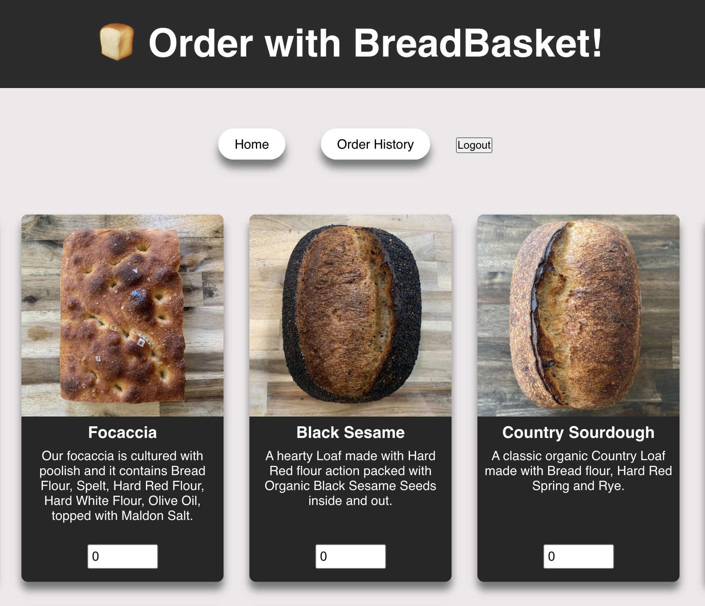
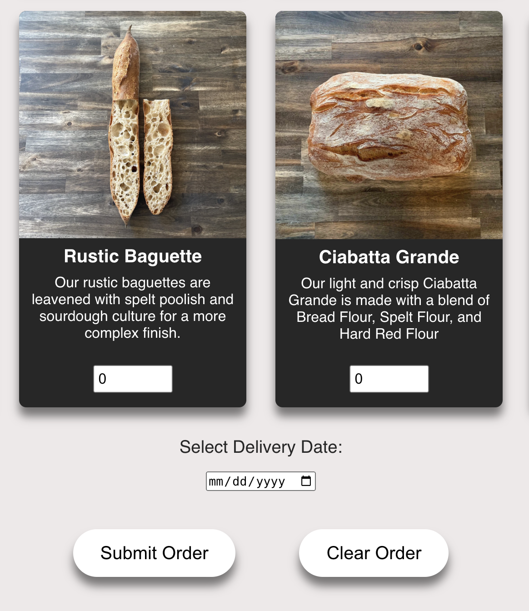
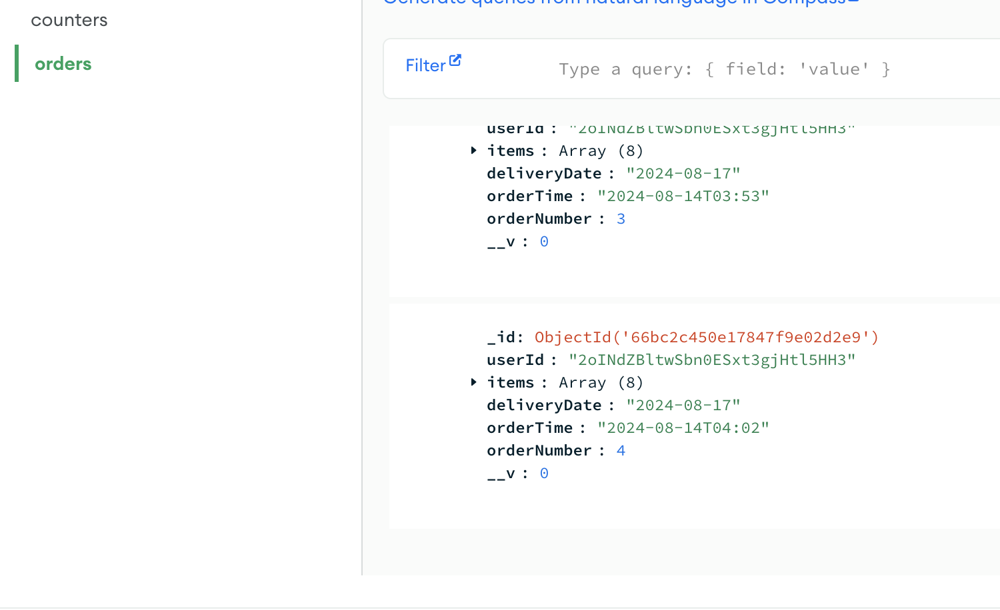
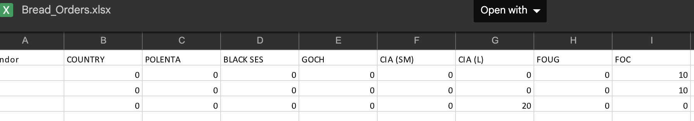

# Breadbasket

## Overview

Breadbasket is a full-stack application built to provide a custom business solution that uses React for the frontend, Node.js/Express for the backend, MongoDB as a database, and Firebase for user authentication. The frontend provides an intuitive interface for vendors to log in and place their orders. The backend automates order processing by querying the database, generating Excel reports, and emailing them to the relevant recipients.

## Features

- Automated Order Processing: Orders with a delivery date three days from now are automatically gathered at midnight by querying the database and generating an Excel report.
- Excel Report Generation: Excel report are generators with vendors as rows and bread types as columns, summarizing the quantities ordered for the bakery on a given bake day.
- Email Notifications: The generated Excel report is emailed to the business owner automatically at midnight in order to prepare for the bake the following day while the vendors who placed the orders are automatically sent an email of their confirmation order.
- Intuitive Frontend: Vendors can log in via email and seamlessly place orders with the bakery.

## Screenshots

